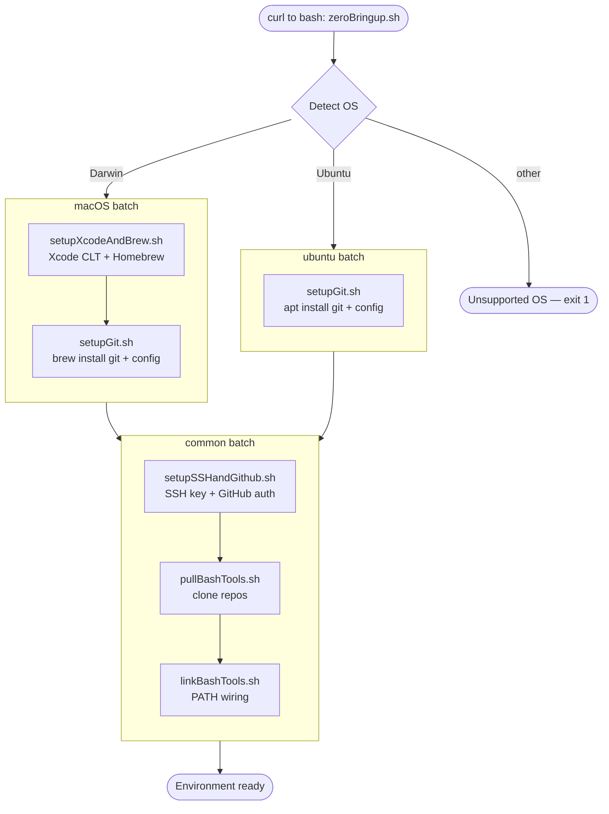

# Zero Bringup

```sh
/bin/bash -c "$(curl -fsSL https://raw.githubusercontent.com/kopecn/zeroBringup/refs/heads/main/zeroBringup.sh)"
```

Bootstraps a fresh **macOS** or **Ubuntu** machine into a ready-to-work
development environment with a single command. `zeroBringup.sh` detects the OS,
runs the matching per-OS setup batch (install prerequisites, git), then a shared
`common` batch (SSH/GitHub, clone repos, wire up PATH). Each sub-script is
fetched from GitHub and piped into `bash` individually so interactive prompts
keep working.

## Layout

Scripts live in `zeroScripts/`, split by responsibility:

| Folder | Script | Runs on | Purpose |
|--------|--------|---------|---------|
| `macOS/` | `setupXcodeAndBrew.sh` | macOS | Install Xcode Command Line Tools + Homebrew |
| `macOS/` | `setupGit.sh` | macOS | `brew install git`; set global user.name/email |
| `ubuntu/` | `setupGit.sh` | Ubuntu | `apt install git`; set global user.name/email |
| `common/` | `setupSSHandGithub.sh` | both | Generate ED25519 SSH key, configure & verify GitHub |
| `common/` | `pullBashTools.sh` | both | Clone personal repos into the standard layout |
| `common/` | `linkBashTools.sh` | both | Append `bashTools/hostScripts` to PATH |

The OS-specific batch runs first (it installs the prerequisites the common batch
depends on), then the common batch runs identically on both platforms.

## Flow


